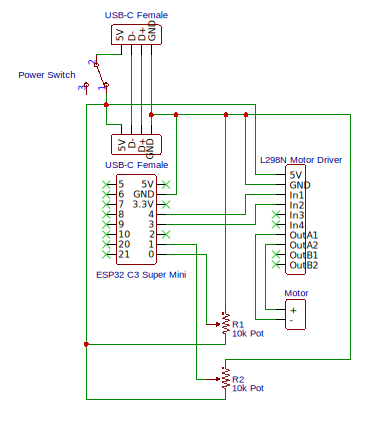

# Motor String Cat Toy

## Hardware

### For the main station

- 1 x [ESP32 C3 SuperMini](https://www.espressif.com/en/products/socs/esp32-c3)
- 1 x [Mini L298N Dual motor driver mini](./datasheets/L298N_mini_dual_motor_driver.pdf)
- 1 x 6V 200RPM DC motor
- 2 x 10kΩ potentiometer to control the motor speed and randomness  // TODO: Correct count
- 1 x Latching button to control power
- 1 x USB-C Female connector to connect power
- 1 x 3D printed case

### For each auxiliary station

- 1 x 608R bearing
- 1 x 3D printed case


## Wiring



## Development Environment

This project is built in a `no_std` environment utilizing the `esp-hal` crate in conjunction with the [Embassy](https://embassy.dev/) framework.

- Rust via [rustup](https://rustup.rs/)
- Install [ESP32 Rust tooling](https://docs.esp-rs.org/book/installation/index.html)

```shell
cargo install espup
espup install
```

## Resources

- [The Rust on ESP Book](https://docs.esp-rs.org/book/introduction.html)
- [Embassy Book](https://embassy.dev/book/) about the [Embassy](https://embassy.dev/) embedded framework
